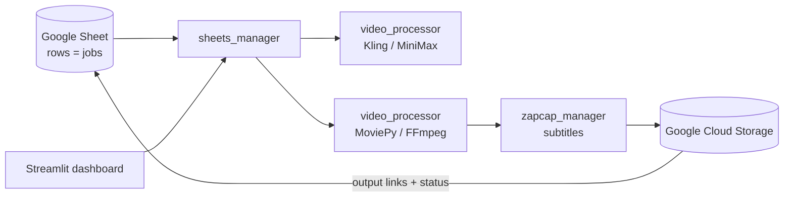

# Bulk Video Rendering Pipeline

**A Google-Sheets-driven batch pipeline that turns spreadsheet rows into finished, subtitled marketing videos — image animation, voiceover handling, subtitles, and cloud delivery, fully automated.**

    

> **Note:** This repo is a public snapshot of a private production codebase — history squashed to a single commit to strip credentials and client data.

---

## 🎯 Overview

Producing dozens of short marketing videos a day is an operations problem as much as a creative one. This pipeline treats a **Google Sheet as the single source of truth**: every row describes a video job (assets, voiceover, animation choices, target language), and the system works through the rows end-to-end — animating stills into motion clips, assembling the video, burning in subtitles, uploading the result to cloud storage, and writing status + output links back to the sheet.

Non-technical operators run the whole thing from the spreadsheet; a Streamlit dashboard gives live visibility into processing.

This is the earlier generation of my video-automation work — its successor, [AI Video Foundry](https://github.com/Orcules/ai-video-foundry), evolved the concept into a prompt-driven platform with an API and Studio UI. This repo shows the batch/ops-focused approach that came first.

## ✨ Key Features

- **Google Sheets as the single source of truth** — jobs, assets, statuses, and output links all live in the sheet; the pipeline reads pending rows and writes results back (`sheets_manager.py`).
- **Image-to-video animation** — animates product stills via Kling / MiniMax (through the GoAPI relay), with task submission, polling, and per-row tracking handled by the core engine (`video_processor.py`); `animation_manager.py` provides a lighter-weight standalone Kling/MiniMax client used by the v3 orchestrator.
- **Automated subtitles** — ZapCap integration with task lifecycle management: submit, poll, recover stuck tasks (`zapcap_manager.py`).
- **Video assembly** — MoviePy/FFmpeg-based build of the final clip from scenes, voiceover, and music (`video_processor.py`).
- **Cloud delivery** — results uploaded to Google Cloud Storage; public links written back to the sheet.
- **Error isolation** — the pipeline works row by row and continues past a failed row, so one bad job never kills the run.
- **Ops dashboard** — a Streamlit app (`app.py`) for launching runs and watching live logs.

## 🏗️ Architecture



## 🧰 Tech Stack

| Layer | Technology |
|-------|------------|
| Language | Python 3 |
| Job source / state | Google Sheets (gspread + google-auth) |
| Animation | Kling, MiniMax (GoAPI relay) |
| Video processing | MoviePy, FFmpeg, OpenCV, Pillow |
| Subtitles | ZapCap |
| Storage | Google Cloud Storage |
| Ops UI | Streamlit |

## 🚀 Getting Started

```bash
# 1. Install dependencies
pip install -r requirements.txt

# 2. Configure credentials
cp .env.example .env          # fill in your API keys
#    plus place your Google service_account.json in the repo root (gitignored)

# 3. Run the pipeline over pending sheet rows
python run_turbovid_v3.py

# or launch the ops dashboard
streamlit run app.py
```

## 📁 Project Structure

```
bulk-video-rendering-pipeline/
├── turbovid_v3.py            # Pipeline orchestrator (Sheets → animate → build → subtitle)
├── run_turbovid_v3.py        # Entry point
├── sheets_manager.py         # Google Sheets read/write, row lifecycle
├── animation_manager.py      # Standalone Kling / MiniMax API client (v3 path)
├── video_creator.py          # File download/upload + validation helpers (v3 path)
├── video_processor.py        # Core processing engine (animate, build, subtitle, upload)
├── zapcap_manager.py         # Subtitle task lifecycle
├── app.py                    # Streamlit ops dashboard
├── config.py                 # Env-driven configuration
└── .env.example              # Environment template
```

## License

Released under the [MIT License](LICENSE). Built as a personal portfolio project.
